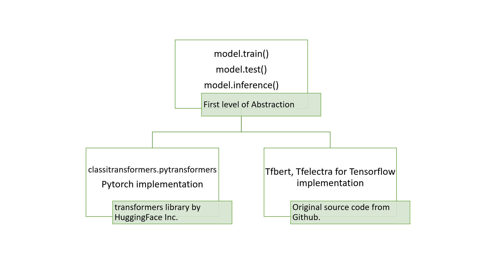

# Classi Transformers — An Easier Way to train, test and deploy transformer-based Models using both Pytorch and Tensorflow
 
# Preface
ClassiTransformers is a wrapper library around Transformers library created and maintained by Hugging Face Inc. who have written codes in pytorch and tensorflow to enable machine learning enthusiasts to easily access transformer-based models. This package also integrates Tensorflow-based models into the package with the source code from github. KUDOS to the great work done by Google, Facebook AI and HuggingFace Inc. to create, maintain and package the models into implementable code. 

# Introduction
Transformer based Language Models like BERT and ELECTRA have broken all previous records on GLUE benchmark and are cutting edge models in the field on Natural Language Processing. These models are extremely generic and can perform state-of-the-art on all 11 domains of NLP, simply by fine-tuning the models on a much smaller dataset as the models are pretrained on massive unannotated data. This enables the end user to get best possible result for a particular problem even with a very small dataset.

We want to further simplify this process of using Language Models by creating a wrapper library around transformers to enable the end user to train, test and create deploy-ready models with each part of the process happening in just 1 line of code.  

# ClassiTransformers

The classitransformers library was created to create a package which provides a simple 5 step abstraction to train, test and create deployable transformer-based models provided by transformers library as well as tensorflow implementation of the original source code for transformer based models. The idea of the package was to create an abstraction i.e both tensorflow and pytorch implementation of the transformer-based models can be used in just 5 lines of code. 

Along with the models and their abstraction, we have provided some special utilities like "downloader" to improve the overall coding experience of the user.
Classitransformers also makes it very easy to feed input to the model during training. There is no need to pass sentences manually or to perform file operations and feed input to the model. Only the file path for input and the base model has to be passed in configs object and the package will do the rest of the work for you.

# Installation

1. Install Anaconda or Miniconda Package Manager from <a href="https://docs.conda.io/en/latest/miniconda.html">here</a>
2. Create a new virtual environment and install the required packages.
```
conda create -n desired_name python=your_python_version
conda activate desired_name
```
3.
From PyPI
```
pip install classitransformers
```
You can also clone the github repository https://github.com/fidelity/classitransformers.git to use the package through the latest source code.

with requirements.txt:
```
pip install -r requirements.txt
```

with yml file, create conda environment:
```
conda env create -f environment.yml
source activate env
```

# Structure
<div align="center"></div>
classitransformers.pytransformers - Includes all pytorch-based text classification models from transformers library.
This file contains the pytorch code for implementing models like ALBERT, RoBERTa, DistilBERT currently.

classitransformers.tfelectra - Includes tensorflow-based Electra model for text classification

classitransformers.tfbert - Includes tensorflow-based BERT model for text classification

classitransformers.report - Used for reporting performance metrics. (precision, recall, F1, confusion matrix)

This file contains the code display all the performance metrics using the testing output labels versus the original testing data labels, along with a vibrant colourful confusion matrix to understand the ratio of errors for each label.

classitransformers.configs - Used for initializing the hyperparameters of the language models. Also checks and creates the necessary directories.

classitransformers.downloader - Used for downloading any of the 5 language models.

This is a utility created to specifically combat the problem of <b>proxy servers</b> provided by the IT organisation, which sometimes <b>do not allow</b> the <b>auto-download</b> option of the original model provided by transformers library.
The classitransformers.downloader utility uses core python libraries like wget to download the particular model. The user just has to pass the name of the model and the downloader will create a directory with a generic name and download the model with just 1 extra line of code.

# Usage 

## Data Preparation

The directory for input files needs to be specified while creating the config object. The files should be named train.csv, dev.csv, test.csv .test.csv may or may not have the labels. Labels would be useful forgenerating the report after testing.

Please check data_preparation_format.txt in https://github.com/fidelity/classitransformers repository for details.

## Quick Start

Supports text classification with any number of labels.
```
from classitransformers.report import metrics
from classitransformers.configs import Configs
from classitransformers.tfelectra import ElectraClassification

config = Configs(pretrained_model_dir = './models/Electra_base/',
              model_name='electra',
              num_train_epochs=3, 
              train_batch_size = 16,
              eval_batch_size = 8, 
              do_train = True, 
              do_eval = True, 
              label_list = ["0", "1", "2", "3", "4"],
              max_seq_length = 256,
              data_dir = "./datasets/bbcsports/", 
              output_dir = "./electra_output_sports/")

model = ElectraClassification(config) 

model.train()
prediction = model.test()

y_pred = [np.argmax(tup) for tup in prediction]
print(y_pred)
```
We have tested the package for maximum 19 classes (<a href="https://www.kaggle.com/drtoshi/semeval2010-task-8-dataset">Semeval 2010 Task-8 dataset</a>).

# Class Methods

The class methods <b>do not</b> take any parameters. All the parameters are predefined to <b>improve the clarity</b> of the code.

<b>train()</b> Fine-Tunes(trains) the model and saves the model and config file in the output_dir directory. Validation is done after each epoch.

<b>test()</b> Tests the model for test dataset. Returns the prediction labels.

<b>export_model()</b> Exports checkpoint model to .pb fotmat. Used for tensorflow-serviing while inferencing.(Currently only for BERT)

<b>inference()</b> Inference on any input csv in batches using tensorflow serving for .pb model. (Currently only for BERT)

<b>text_inference()</b> Inference on list of sentences as input.

<b>report()</b> Prints and returns the accuracy and other metrics. Also prints Confusion Matrix (decorated matrix using matplotlib)

# Similarity with SimpleTransformer package

We were given the opportunity during internship at Emerging Technology Department at Fidelity Investments during May-Jun 2020 to create a package for easy usage of BERT based models according to the company's requirements, for which we created an abstraction borrowing from transformers package from scratch, which ended up similar to simpletransformers package with a few changes in the style of abstraction codes provided and the way input is given to the model. Nevertheless, we do recommend you check out the classitransformers package and star it if you like.

# Conclusion

This is our sincere attempt to simplify the use of transformer-based models in both pytorch and tensorflow, the two most popular machine learning frameworks in open source, to make it easier to the user to explore the benefits of these models without much technical know-how.
Hope you like it. Peace !!
